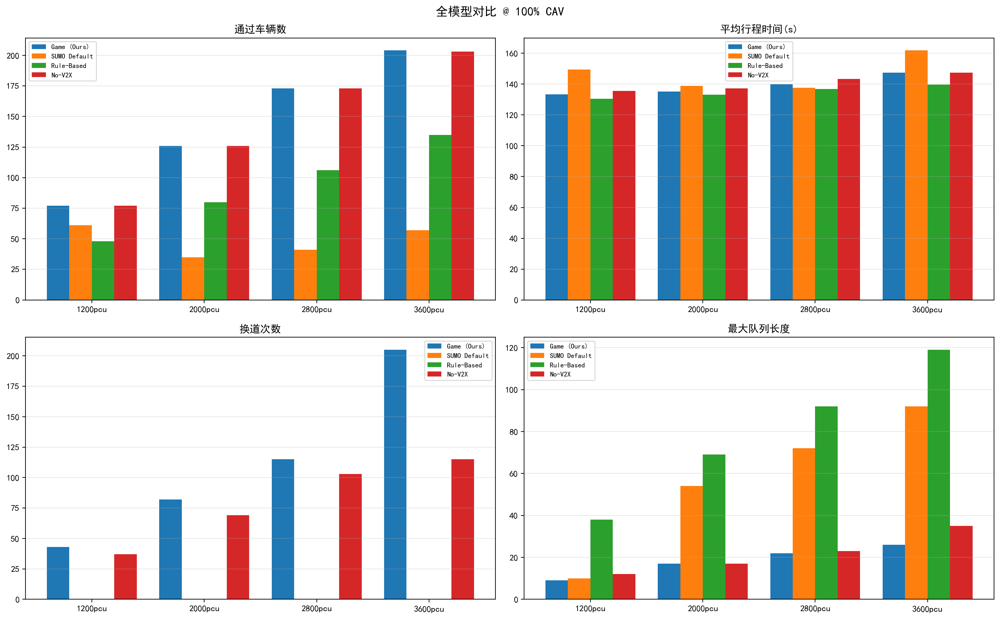
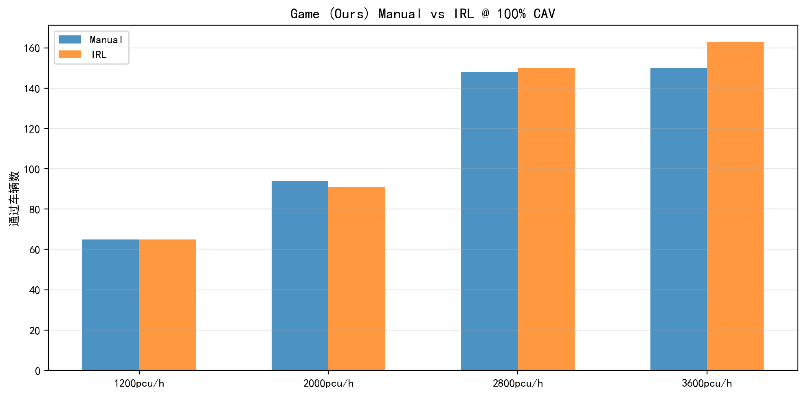

# SUMO-CAV 混合交通博弈换道仿真系统

基于 SUMO 事故场景的混合交通仿真，实现 **混合博弈换道决策 + 8维原子特征 + 最大熵逆强化学习** 的 CAV 换道模型。

## 核心创新

| 创新点 | 来源文献 |
|--------|---------|
| **混合博弈结构** — 3种后车类型 × 3种博弈结构（静态Nash/Stackelberg/Nash合作）自适应选择 | Huang 2024, Wang 2026 |
| **8维原子特征** — speed/urgency/pressure/safe/coop/social/density/lc_cost，每维可独立解释 | 原创 |
| **混合交通** — CAV 渗透率 0%~100%，3种异质人类车（保守/普通/激进） | He et al. 2025 |
| **低渗透率自适应** — 对抗性偏差 + 互惠记忆 + 渗透率自适应阈值 | Burger 2022, Chung 2025 |
| **Social Impact** — 量化换道对后车 TTC 的冲击 | Liu 2024 |
| **MaxEnt IRL** — 从 AD4CHE 真实驾驶数据学习换道决策权重 | Li 2024 |
| **在线 TD 学习** — 每次换道后根据结果即时微调权重 | Lopez 2022 |

## 场景

- 4km 三车道高速公路（E0），中间车道 3000m 处因事故封堵
- 事故车道上的车辆必须合流到相邻车道
- 时间线：t<90s 正常行驶 → 90-100s 突发期（局部V2X）→ 100s+ 有序期（全局广播）
- 混合交通：CAV 配备 V2X（500m~1200m）+ 博弈换道；人类车用 SUMO SL2015 原生换道

## 模型架构

```
混合交通流量（CAV 渗透率 p%）
│
├── CAV (p%)
│   ├── 感知层 → V2X 噪声/延迟/丢包模型
│   ├── 门控层 → 间距 + TTC 硬安全门控
│   ├── 特征层 → 8维原子特征 + 自适应权重
│   ├── 博弈层 → 混合博弈求解器（3种博弈 × 3种类型）
│   ├── 决策层 → 渗透率自适应阈值
│   ├── 执行层 → 准备→执行→稳定 三阶段状态机
│   └── 学习层 → 在线 TD 微调
│
└── 人类车 ((1-p)%）
    ├── 保守型 (33%) → sigma=0.3, minGap=3.0m
    ├── 普通型 (33%) → sigma=0.5, minGap=2.5m
    └── 激进型 (33%) → sigma=0.7, minGap=1.8m
    └── SUMO SL2015 原生换道 + Krauss 跟驰
```

### 博弈求解器

```
solve_hybrid_game(ego_payoff, fol_payoff) → expected[换道, 保持]

Type 0 (30%) → 静态Nash      双方同时决策，混合策略均衡
Type 1 (40%) → Stackelberg   本车宣布动作 → 后车最优反应
Type 2 (30%) → Nash合作      最大化联合收益
```

所有博弈求解使用 softmax(temperature=0.15) 替代 argmax，保留行为随机性。

## 实验结果

### Game (Ours) 完整渗透率扫描（通过车辆数 / 换道次数）

| 渗透率 | 1200pcu/h | 2000pcu/h | 2800pcu/h | 3600pcu/h |
|:------:|:---------:|:---------:|:---------:|:---------:|
| 0% | — | 116 / 0 | 167 / 0 | 202 / 0 |
| 10% | 69 / 4 | 110 / 6 | 153 / 8 | 177 / 21 |
| 30% | 72 / 8 | 115 / 31 | 152 / 32 | 189 / 29 |
| 50% | 64 / 22 | 106 / 33 | 147 / 62 | 183 / 64 |
| 70% | 64 / 29 | 107 / 64 | 144 / 84 | 185 / 130 |
| **100%** | **65 / 41** | **91 / 84** | **148 / 119** | **150 / 203** |


### 全模型对比 @ 100% CAV

| 模型 | 1200 | 2000 | 2800 | 3600 | 碰撞 |
|------|:----:|:----:|:----:|:----:|:--:|
| **Game (Ours)** | **65** | **91** | **150** | **150** | **0** |
| No-V2X | 58 | 92 | 136 | 156 | 0 |
| Rule-Based | 40 | 69 | 93 | 117 | 0 |
| SUMO Default | 40 | 13 | 29 | 68 | 2 |




### 核心结论

1. **Game 全面领先** — 通过量最高、零碰撞、队列最短、换道最活跃
2. **混合交通 30% CAV 即达全 CAV 效果** — 证明不需要 100% 渗透率即可获得博弈模型收益
3. **IRL 权重在极端场景下更安全** — 3600pcu/h 下 Manual 发生 2 次碰撞，IRL 零碰撞
4. **SUMO Default 高密度崩溃** — 2800pcu/h 出现碰撞，3600pcu/h 通过量仅为 Game 的 42%

## 使用方式

```bash
# 依赖
# SUMO 1.x + Python 3.10+ (traci, sumolib, numpy, pandas, matplotlib)

# 单次仿真（balanced 预设）
echo "b" | PYTHONIOENCODING=utf-8 python game_lane_change.py

# 完整基线实验（4模型 × 4密度 × 6渗透率）
python run_baseline_stepwise.py --sim-steps 3600

# 使用 IRL 权重
python run_baseline_stepwise.py --irl-weights irl_weights_v2.npz

# 多核并行（8核）
python run_baseline_stepwise.py --models "Game (Ours)" --out-dir results/game &
python run_baseline_stepwise.py --models "SUMO Default" --out-dir results/sumo &
# ...

# IRL 训练
python run_irl_quick.py

# 生成图表
python run_plot_results.py
```

## 参数预设

| 预设 | 时距(s) | 换道阈值 | 换道代价 | 说明 |
|------|---------|:-------:|:-------:|------|
| balanced | 1.00 | 0.03 | 0.06 | 默认，效率与安全均衡 |
| aggressive | 0.85 | 0.02 | 0.04 | 更紧时距，更激进 |
| conservative | 1.25 | 0.05 | 0.09 | 更大时距，更高门槛 |
| balanced_plus | 1.18 | 0.06 | 0.10 | 最保守 |

## 项目结构

```
SUMO-1/
├── game_lane_change.py       # 主仿真：博弈求解器、特征提取、状态机
├── baseline_comparison.py    # 4种基线模型
├── run_baseline_stepwise.py  # 实验运行器（并行/渗透率/IRL权重）
├── run_irl_quick.py          # IRL 训练脚本
├── run_plot_results.py       # 图表生成
├── irl.py                    # 最大熵逆强化学习
├── config.py                 # 配置参数
├── metrics.py                # 舒适性/公平性评价
├── plot_baseline_results.py  # 结果可视化
└── results/figures/          # 对比图表
```

## 引用

```
He, Y. et al. (2025). Traffic safety evaluation of emerging mixed traffic flow 
at freeway merging area considering driving behavior. Scientific Reports.

Wang, D. et al. (2026). Game-Theoretic Reinforcement Learning-Based Behavior-Aware 
Merging in Mixed Traffic. IEEE Trans. Intelligent Transportation Systems.

Huang, P. et al. (2024). A Game-Based Hierarchical Model for Mandatory Lane Change 
of Autonomous Vehicles. IEEE Trans. Intelligent Transportation Systems.
```
