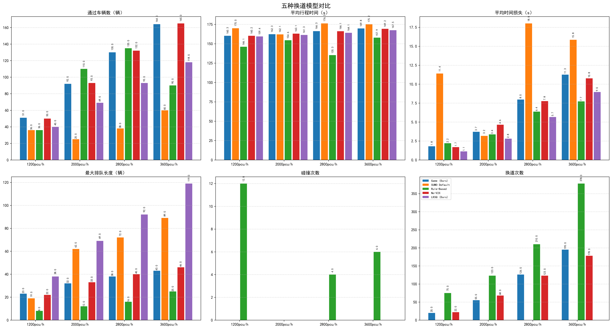
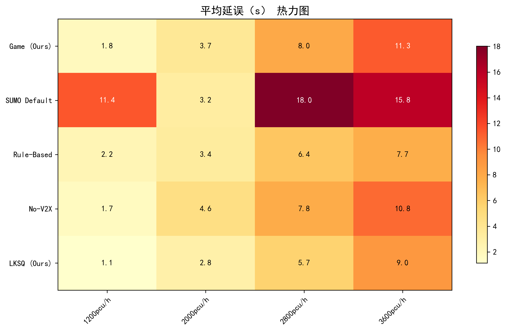
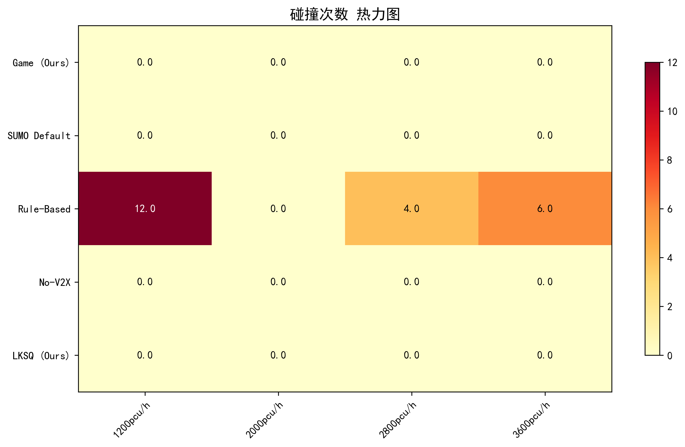
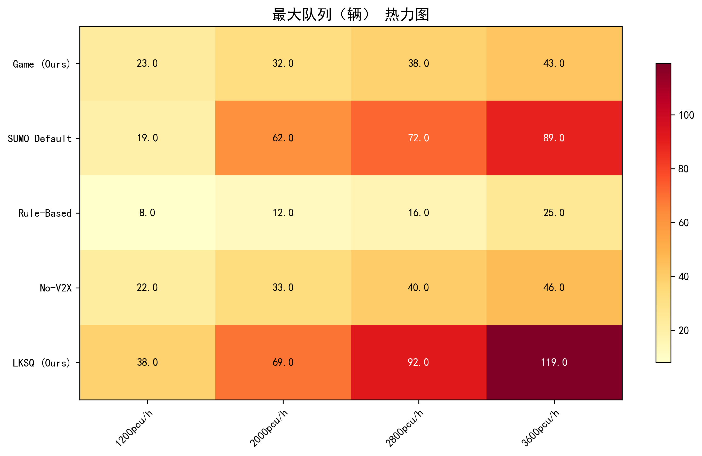
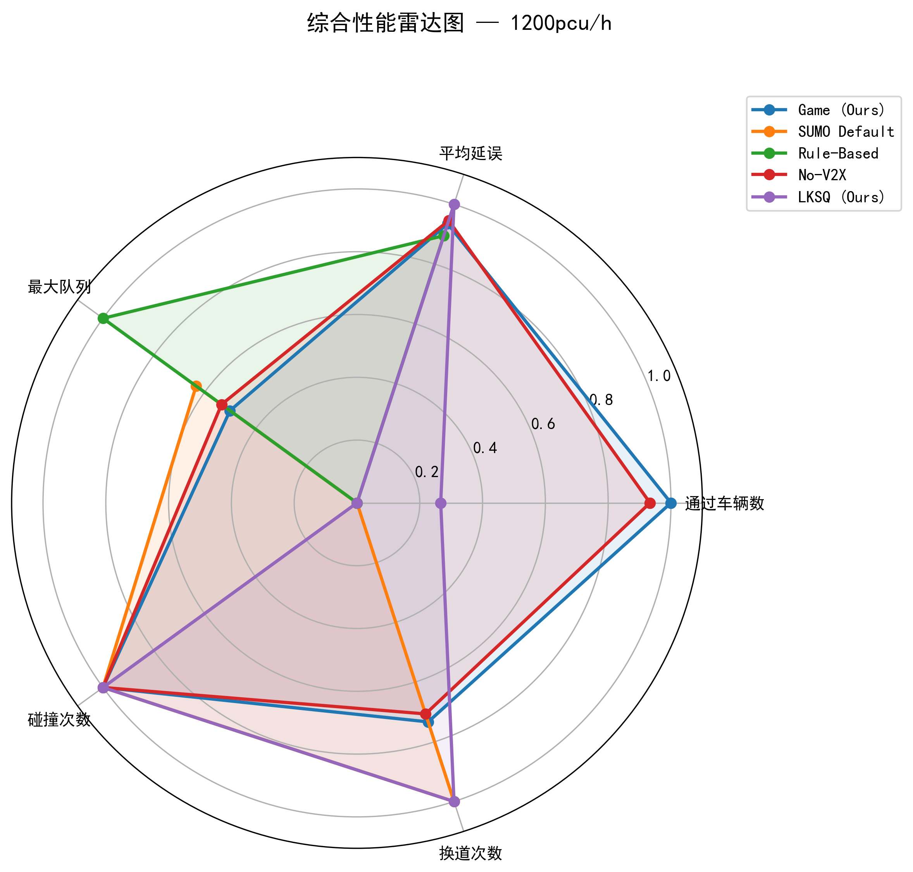
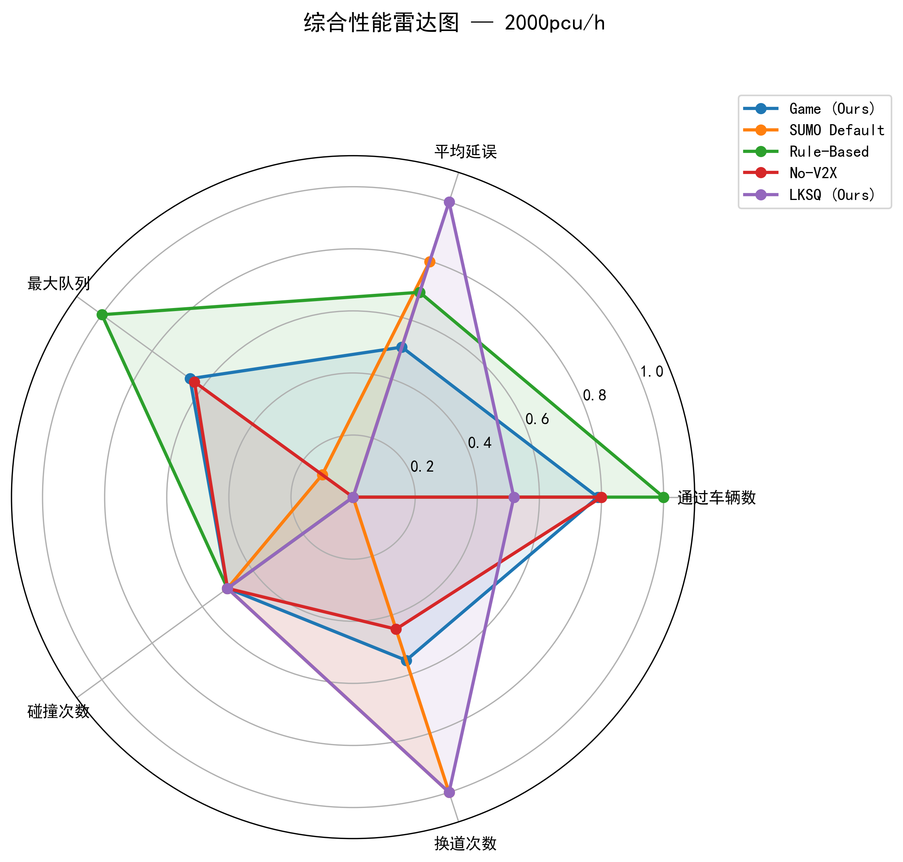
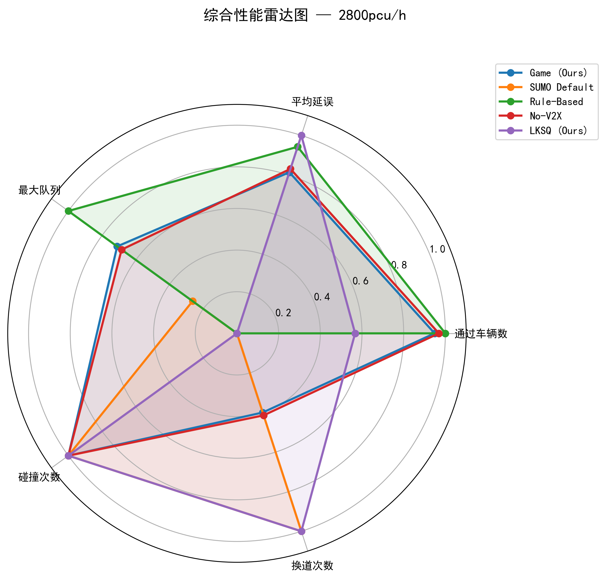
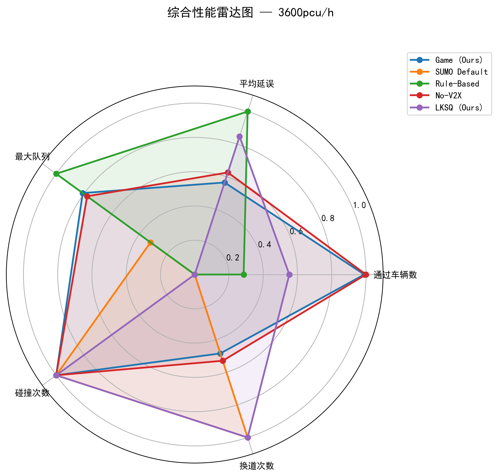
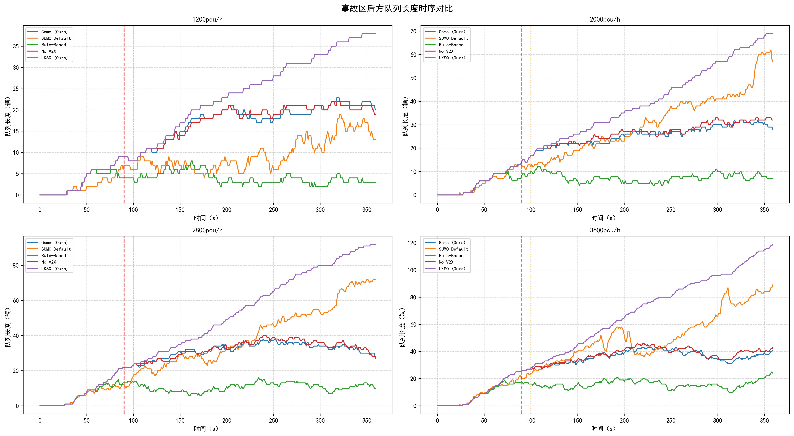
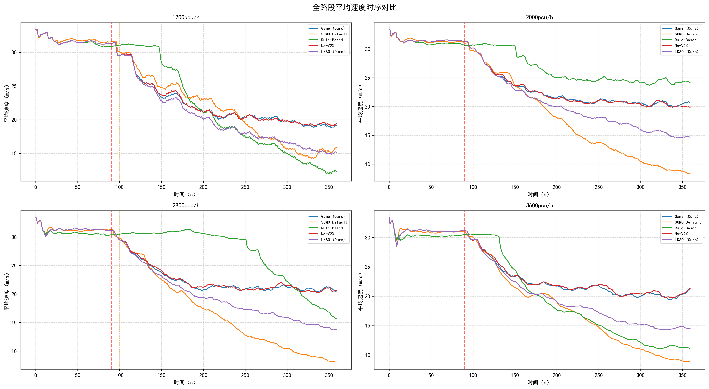

# SUMO-CAV 博弈换道仿真系统

全 CAV（网联自动驾驶）交通仿真，基于 SUMO 事故场景，实现博弈换道决策。

## 基线对比结果

4 种换道决策模型在 4 种交通密度（1200/2000/2800/3600 pcu/h）下各运行 360 秒仿真，关键指标如下。

### 综合对比



### 热力图（全模型 × 全场景）

| 平均延误 | 碰撞次数 | 最大队列 |
|:--------:|:--------:|:--------:|
|  |  |  |

### 雷达图（分场景多维度对比）

| 1200 pcu/h | 2000 pcu/h |
|:----------:|:----------:|
|  |  |

| 2800 pcu/h | 3600 pcu/h |
|:----------:|:----------:|
|  |  |

### 时序图

| 队列长度时序 | 平均速度时序 |
|:-----------:|:-----------:|
|  |  |

### 数值结果总表

| 模型 | 密度 (pcu/h) | 通过车辆 | 平均行程 (s) | 平均延误 (s) | 换道次数 | 碰撞 | 最大队列 |
|------|:-----------:|:--------:|:-----------:|:-----------:|:-------:|:----:|:-------:|
| **Game (Ours)** | 1200 | 51 | 160.33 | 1.80 | 20 | 0 | 23 |
| | 2000 | 92 | 162.30 | 3.71 | 55 | 0 | 32 |
| | 2800 | 130 | 166.32 | 7.97 | 126 | 0 | 38 |
| | 3600 | 164 | 169.76 | 11.26 | 195 | 0 | 43 |
| **SUMO Default** | 1200 | 36 | 169.96 | 11.40 | 0 | 0 | 19 |
| | 2000 | 25 | 162.12 | 3.18 | 0 | 0 | 62 |
| | 2800 | 38 | 176.29 | 18.02 | 0 | 0 | 72 |
| | 3600 | 60 | 175.20 | 15.85 | 0 | 0 | 89 |
| **Rule-Based** | 1200 | 36 | 146.07 | 2.21 | 75 | 12 | 8 |
| | 2000 | 110 | 154.56 | 3.37 | 123 | 0 | 12 |
| | 2800 | 135 | 135.35 | 6.38 | 210 | 4 | 16 |
| | 3600 | 90 | 157.93 | 7.72 | 378 | 6 | 25 |
| **No-V2X** | 1200 | 50 | 160.25 | 1.69 | 22 | 0 | 22 |
| | 2000 | 93 | 163.07 | 4.64 | 68 | 0 | 33 |
| | 2800 | 132 | 166.12 | 7.76 | 123 | 0 | 40 |
| | 3600 | 165 | 169.24 | 10.76 | 178 | 0 | 46 |

---

## 概述

三段式高速公路（E0）中间车道（车道 1）在约 3000m 处因事故封闭，迫使车辆向两侧合流。所有车辆均为 CAV，配备 V2X 通信、感知噪声模型和多阶段换道决策逻辑。

### 事故阶段

| 阶段 | 时间 | 行为 |
|------|------|------|
| 正常行驶 | t < 90s | CACC 类跟驰巡航 |
| 突发期 | 90-100s | 事故发生，仅局部 V2X，高紧迫度 |
| 有序期 | 100s+ | 全局 V2X 广播激活，有序疏散 |

## 核心功能

### 1. 同时博弈 (`compute_payoff`)
基于 2×3 收益矩阵的换道博弈：本车可选择换道/不换道，目标车道后车可选择加速/保持/减速，计算期望收益后决策。

### 2. 行为预测 (`get_follower_prior`)
根据后车速度和间距动态估计其行为概率（加速/保持/减速），在线加速度轨迹修正预测精度。

### 3. 紧急制动覆盖
被阻塞车道上的安全覆盖层：接近障碍物的车辆受安全速度包络限制，在最后 95m 强制刹停。距障碍 `EMERGENCY_NO_LC_DIST`（90m）内禁止发起新换道。

### 4. 协同让行
目标车道后车可接收协同减速请求以打开间隙。间隙达到 `COOP_MIN_GAP` 后，换道执行，支援车恢复正常控制。

## 配置参数

所有参数集中在 `config.py`，按模块组织：

- **仿真基础**：步长、总步数
- **事故参数**：位置、车道、触发时间
- **通信参数**：V2X 范围、丢包率、感知噪声
- **安全参数**：TTC 阈值、最小间距
- **紧急制动**：反应时间、减速度、覆盖区域
- **换道博弈**：增益阈值、换道代价、冷却时间
- **协同换道**：头距阈值、减速幅度
- **动力学约束**：横向加速度、换道时长
- **参数标定预设**：balanced、balanced_plus、conservative、aggressive

### 参数预设对比

| 预设 | 时距(s) | 突发期换道阈值 | 换道代价 | 说明 |
|------|---------|--------------|---------|------|
| balanced | 1.00 | 0.030 | 0.060 | 默认，效率与安全均衡 |
| balanced_plus | 1.18 | 0.060 | 0.100 | 更保守的巡航 |
| conservative | 1.25 | 0.050 | 0.090 | 更大时距，更高换道门槛 |
| aggressive | 0.85 | 0.020 | 0.040 | 更紧时距，更激进并线 |

## 使用方式

### 依赖

- SUMO 1.x 已安装（默认路径：`C:\Program Files (x86)\Eclipse\Sumo`）
- Python 3.10+，需安装 `traci`、`sumolib`、`numpy`、`pandas`、`matplotlib`

### 运行完整仿真

```bash
python game_lane_change.py
```

按提示选择参数预设，或通过管道输入：

```bash
# 单预设
echo "b" | PYTHONIOENCODING=utf-8 python game_lane_change.py

# 全预设对比
echo "all" | PYTHONIOENCODING=utf-8 python game_lane_change.py
```

### 运行基线对比实验

```bash
# 完整运行（4 模型 × 4 场景，约 40 分钟）
python run_baseline_stepwise.py

# 快速验证（60 秒仿真）
set SIM_STEPS=600 && python run_baseline_stepwise.py

# 续跑中断的实验
python run_baseline_stepwise.py --resume results\baseline_20260424_211520

# 只跑部分模型/场景
python run_baseline_stepwise.py --models "Game (Ours),No-V2X" --scenarios "1200pcu/h,2800pcu/h"
```

### 环境变量

| 变量 | 默认值 | 说明 |
|------|--------|------|
| `SIM_STEPS` | 3600 | 仿真总步数 |
| `SKIP_GUI_DEMO` | 0 | 设为 `1` 跳过交互式 GUI 演示 |
| `PYTHIOENCODING` | - | 设为 `utf-8` 可修复 Windows GBK 编码错误 |

## 输出

结果保存至 `results/<时间戳>/`：

- `results_<时间戳>.csv` — 各场景聚合指标
- `lanechange_dynamics_<时间戳>.csv` — 每车换道日志
- `comparison_<时间戳>.png` — 四指标柱状图（流量、行程时间、延误、队列）
- `queue_timeseries_<时间戳>.png` — 队列长度时序
- `speed_timeseries_<时间戳>.png` — 平均速度时序
- `phase_lanechange_<时间戳>.png` — 突发期/有序期换道对比
- `coop_metrics_<时间戳>.png` — 协同行为统计
- `robustness_metrics_<时间戳>.png` — 冲击度/加速度违规、能耗、通信负载

### 多预设对比

`all` 模式下额外输出：
- `profile_comparison_<时间戳>.png` — 跨预设对比柱状图
- `profile_delay_by_scenario_<时间戳>.png` — 各场景延误对比

## 项目结构

```
SUMO-1/
├── game_lane_change.py      # 主仿真与换道逻辑
├── config.py                # 集中参数配置
├── metrics.py               # 舒适性与公平性评价
├── baseline_comparison.py   # 基线模型对比
├── plot_baseline_results.py # 基线结果可视化
├── run_baseline_stepwise.py # 分步基线运行
├── test_baselines_quick.py  # 基线快速验证
├── accident_highway.net.xml # SUMO 路网
├── accident_highway.rou.xml # 路由定义
├── accident_highway.sumocfg # SUMO 配置
├── viewsettings.xml         # GUI 视图设置
├── images/                  # README 引用图片
├── results/                 # 仿真输出目录
└── Thesis/                  # 论文相关文件
```
